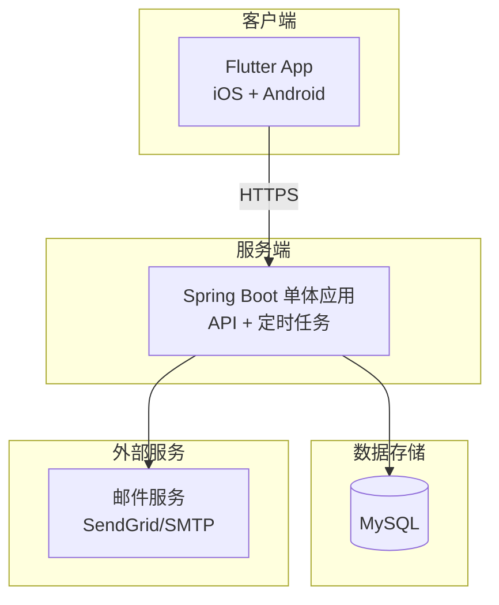
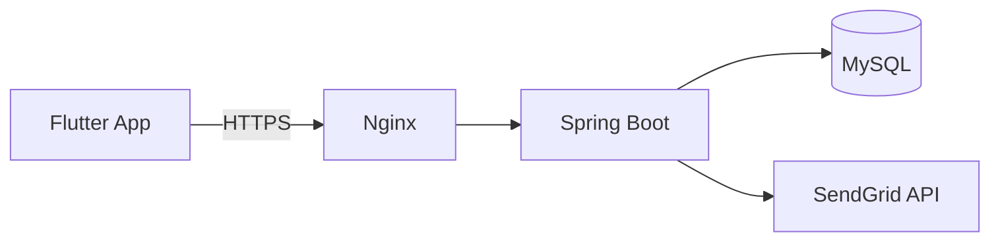
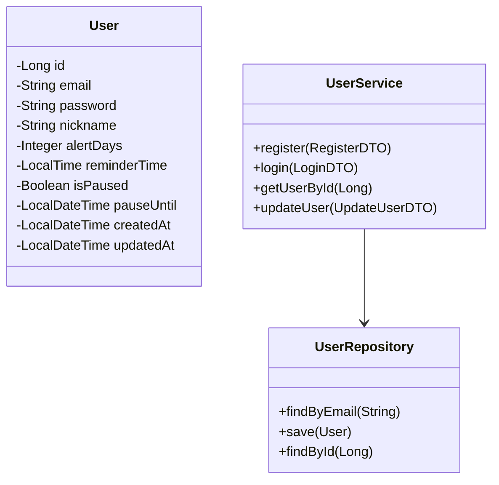
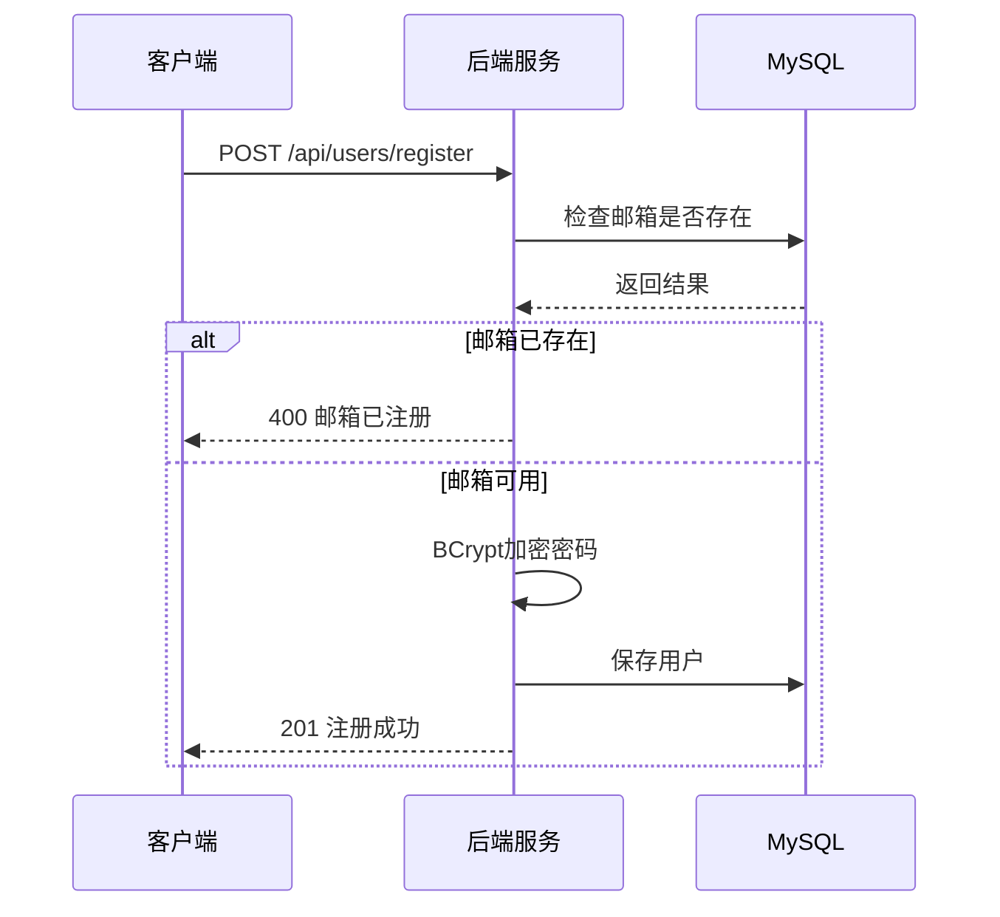
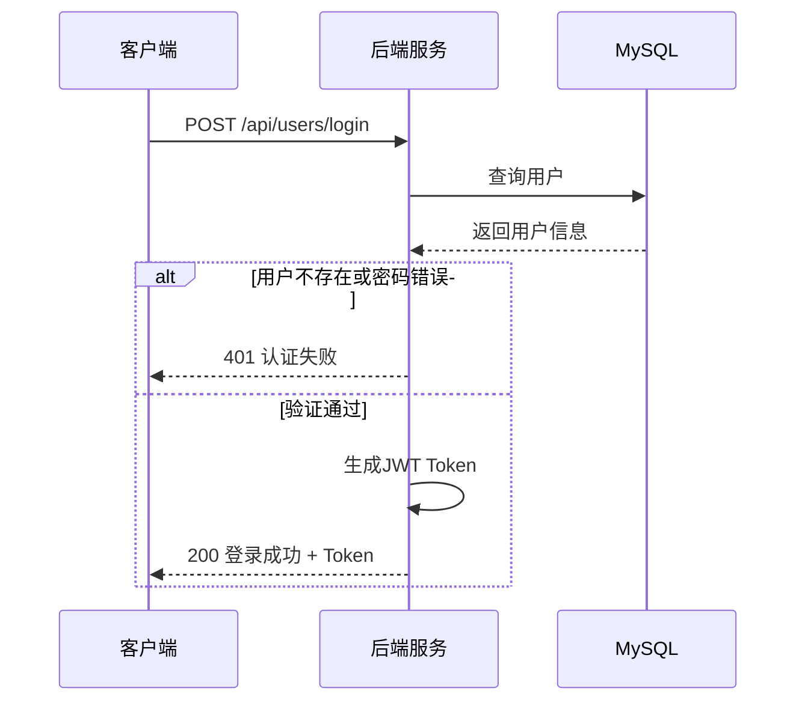
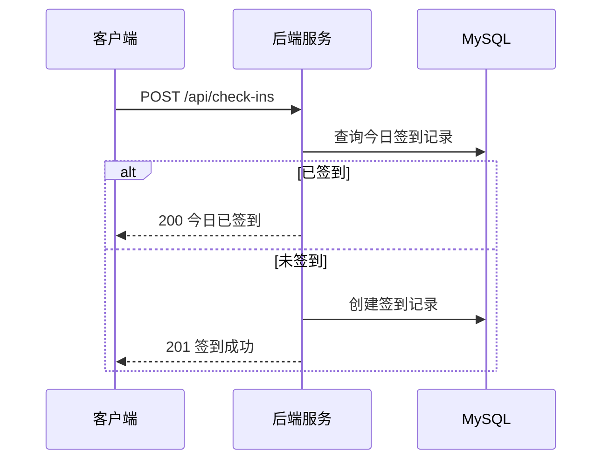
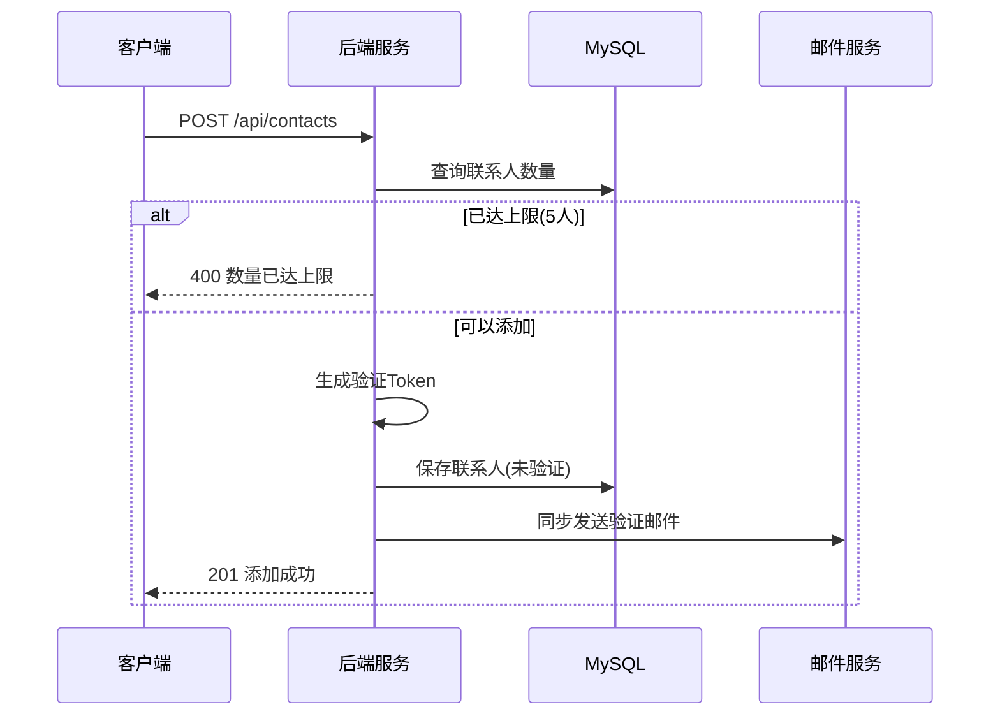
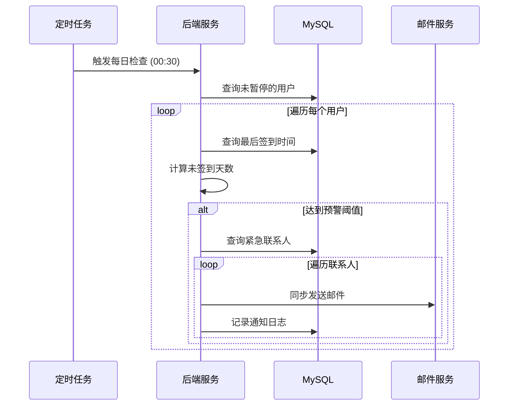
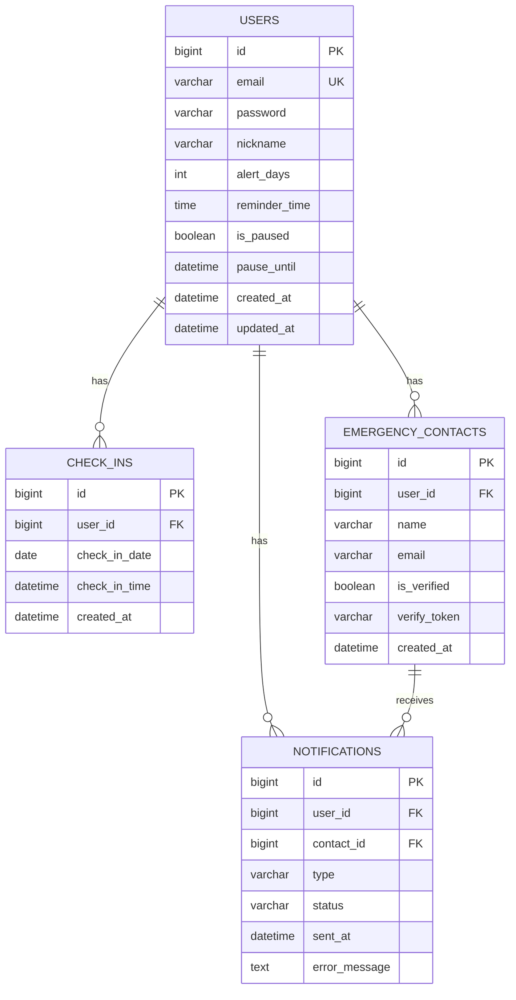

# 死了么 APP 详细设计说明书 (MVP版本)

> 版本: V1.1 MVP  
> 日期: 2026-01-10  
> 状态: 修订版（收敛 MVP 范围）

---

## 1. 引言

### 1.1 编写目的

本文档为"死了么"APP **MVP版本**的详细设计说明书，采用极简架构快速验证产品。

### 1.2 MVP设计原则

| 原则 | 说明 |
|-----|------|
| 最小依赖 | 仅使用必要组件：Flutter + Spring Boot + MySQL |
| 快速上线 | 优先核心功能，简化技术栈 |
| 易于部署 | 单机部署，无需复杂运维 |

### 1.3 代码库现状与迁移

> [!WARNING]
> **当前代码库与文档存在不一致**，需要进行迁移。

| 项目 | 文档设计 | 代码库现状 | 迁移方案 |
|------|----------|------------|----------|
| **前端** | Flutter 3.x | Android 原生 (Kotlin/Compose) | 重建为 Flutter 项目 |
| **后端** | Spring Boot 3.x | 空 Maven 项目 (pom.xml) | 补齐 Spring Boot 依赖和结构 |

**迁移步骤:**
1. 备份当前 `silemore-app/` 作为参考
2. 删除并重建 `silemore-app/` 为 Flutter 项目
3. 完善 `silemore-backend/` 的 Spring Boot 配置

### 1.4 术语定义

| 术语 | 定义 |
|-----|------|
| Check-in | 用户签到操作 |
| Alert Threshold | 触发预警的未签到天数阈值 |
| Emergency Contact | 紧急联系人 |

---

## 2. 系统架构设计

### 2.1 MVP架构图



### 2.2 技术选型

| 组件 | 技术方案 | 说明 |
|-----|---------|------|
| **移动端** | Flutter 3.x | 一套代码，iOS/Android双平台 |
| **后端** | Spring Boot 3.x | Java单体应用 |
| **数据库** | MySQL 8.0 | 关系型数据库 |
| **邮件** | SendGrid / 阿里云邮件 | 第三方邮件服务 |
| **部署** | 单台云服务器 | 如阿里云ECS/腾讯云CVM |

### 2.3 邮件基础设施要求

> [!CAUTION]
> 邮件送达率直接影响产品核心功能，必须完成域名验证配置。

| 配置项 | 说明 | 必须 |
|--------|------|------|
| **域名验证** | SendGrid/阿里云需验证发送域名 | ✅ |
| **SPF记录** | DNS TXT记录，声明授权发送服务器 | ✅ |
| **DKIM签名** | 邮件数字签名，防篡改 | ✅ |
| **DMARC策略** | 邮件认证策略 | 推荐 |
| **发送配额** | SendGrid免费版 100封/天 | 注意 |

**配置示例 (DNS TXT 记录):**
```
# SPF
silemore.com.  TXT  "v=spf1 include:sendgrid.net ~all"

# DKIM (由 SendGrid 提供具体值)
s1._domainkey.silemore.com.  CNAME  s1.domainkey.xxx.sendgrid.net.
```

### 2.4 部署架构 (MVP)



**最低服务器配置:**
- CPU: 2核
- 内存: 4GB
- 硬盘: 50GB SSD
- 带宽: 5Mbps

---

## 3. 模块详细设计

### 3.1 用户模块

#### 3.1.1 类图设计



#### 3.1.2 注册流程



#### 3.1.3 登录流程



### 3.2 签到模块

#### 3.2.1 签到流程 (简化版)



#### 3.2.2 连续签到计算

```java
public int calculateStreakDays(Long userId) {
    LocalDate today = LocalDate.now();
    int streak = 0;
    LocalDate checkDate = today;
    
    while (true) {
        boolean exists = checkInRepository
            .existsByUserIdAndCheckInDate(userId, checkDate);
        
        if (exists) {
            streak++;
            checkDate = checkDate.minusDays(1);
        } else {
            break;
        }
    }
    return streak;
}
```

### 3.3 紧急联系人模块

#### 3.3.1 添加联系人流程



### 3.4 预警通知模块

#### 3.4.1 预警检查流程 (同步发送)



**MVP简化说明:**
- 邮件采用**同步发送**，无需消息队列
- 发送失败直接记录日志，下次定时任务重试
- 每日只发送一次预警邮件，避免骚扰

### 3.5 “未签到”计算规则

| 场景 | 处理规则 |
|------|----------|
| 正常未签到 | 计入未签到天数 |
| 暂停监测期间 | 不计入未签到天数，不触发预警 |
| 账号刚创建 | 从注册日期开始计算 |
| 时区 | 统一使用服务器时区 (Asia/Shanghai) |

```java
// 未签到天数计算示例
public long calculateMissedDays(User user) {
    // 如果暂停监测，返回 0
    if (user.getIsPaused() && user.getPauseUntil() != null 
        && LocalDateTime.now().isBefore(user.getPauseUntil())) {
        return 0;
    }
    
    LocalDate lastCheckIn = checkInRepository
        .findTopByUserIdOrderByCheckInDateDesc(user.getId())
        .map(CheckIn::getCheckInDate)
        .orElse(user.getCreatedAt().toLocalDate());
    
    return ChronoUnit.DAYS.between(lastCheckIn, LocalDate.now());
}
```

---

## 4. 接口设计

### 4.1 接口规范

| 项目 | 规范 |
|-----|------|
| 协议 | HTTPS |
| 格式 | JSON |
| 认证 | Bearer Token (JWT) |
| 版本 | `/api/v1` |

### 4.2 通用响应格式

```json
{
    "code": 200,
    "message": "success",
    "data": { },
    "timestamp": "2026-01-10T12:00:00+08:00"
}
```

### 4.3 接口列表

| 模块 | 方法 | 路径 | 说明 |
|-----|------|-----|------|
| 认证 | POST | /api/v1/users/register | 用户注册 |
| 认证 | POST | /api/v1/users/login | 用户登录 |
| 用户 | GET | /api/v1/users/me | 获取当前用户信息 |
| 用户 | PATCH | /api/v1/users/me/settings | 更新用户设置 |
| 签到 | POST | /api/v1/check-ins | 执行签到 |
| 签到 | GET | /api/v1/check-ins/today | 获取今日签到状态 |
| 签到 | GET | /api/v1/check-ins | 获取签到历史 |
| 联系人 | POST | /api/v1/contacts | 添加联系人 |
| 联系人 | GET | /api/v1/contacts | 获取联系人列表 |
| 联系人 | DELETE | /api/v1/contacts/{id} | 删除联系人 |
| 联系人 | POST | /api/v1/contacts/verify | 验证联系人 |

### 4.4 错误码

| 状态码 | 说明 |
|-------|------|
| 200 | 成功 |
| 201 | 创建成功 |
| 400 | 请求参数错误 |
| 401 | 未授权 |
| 404 | 资源不存在 |
| 409 | 资源冲突 |
| 500 | 服务器错误 |

---

## 5. 数据库设计

### 5.1 ER图



### 5.2 建表语句

```sql
-- 用户表
CREATE TABLE users (
    id BIGINT PRIMARY KEY AUTO_INCREMENT,
    email VARCHAR(100) NOT NULL UNIQUE,
    password VARCHAR(255) NOT NULL,
    nickname VARCHAR(50) NOT NULL,
    alert_days INT NOT NULL DEFAULT 3,
    reminder_time TIME DEFAULT '20:00:00',
    is_paused BOOLEAN NOT NULL DEFAULT FALSE,
    pause_until DATETIME NULL,
    created_at DATETIME NOT NULL DEFAULT CURRENT_TIMESTAMP,
    updated_at DATETIME NOT NULL DEFAULT CURRENT_TIMESTAMP ON UPDATE CURRENT_TIMESTAMP,
    INDEX idx_is_paused (is_paused)
) ENGINE=InnoDB DEFAULT CHARSET=utf8mb4;

-- 签到记录表
CREATE TABLE check_ins (
    id BIGINT PRIMARY KEY AUTO_INCREMENT,
    user_id BIGINT NOT NULL,
    check_in_date DATE NOT NULL,
    check_in_time DATETIME NOT NULL,
    created_at DATETIME NOT NULL DEFAULT CURRENT_TIMESTAMP,
    UNIQUE KEY uk_user_date (user_id, check_in_date),
    FOREIGN KEY (user_id) REFERENCES users(id) ON DELETE CASCADE
) ENGINE=InnoDB DEFAULT CHARSET=utf8mb4;

-- 紧急联系人表
CREATE TABLE emergency_contacts (
    id BIGINT PRIMARY KEY AUTO_INCREMENT,
    user_id BIGINT NOT NULL,
    name VARCHAR(50) NOT NULL,
    email VARCHAR(100) NOT NULL,
    is_verified BOOLEAN NOT NULL DEFAULT FALSE,
    verify_token VARCHAR(64) NULL,
    created_at DATETIME NOT NULL DEFAULT CURRENT_TIMESTAMP,
    INDEX idx_user_id (user_id),
    FOREIGN KEY (user_id) REFERENCES users(id) ON DELETE CASCADE
) ENGINE=InnoDB DEFAULT CHARSET=utf8mb4;

-- 通知记录表
CREATE TABLE notifications (
    id BIGINT PRIMARY KEY AUTO_INCREMENT,
    user_id BIGINT NOT NULL,
    contact_id BIGINT NOT NULL,
    type VARCHAR(20) NOT NULL,
    status VARCHAR(20) NOT NULL,
    sent_at DATETIME NULL,
    error_message TEXT NULL,
    created_at DATETIME NOT NULL DEFAULT CURRENT_TIMESTAMP,
    INDEX idx_user_id (user_id),
    FOREIGN KEY (user_id) REFERENCES users(id) ON DELETE CASCADE,
    FOREIGN KEY (contact_id) REFERENCES emergency_contacts(id) ON DELETE CASCADE
) ENGINE=InnoDB DEFAULT CHARSET=utf8mb4;
```

---

## 6. 安全设计

### 6.1 JWT认证

```java
// JWT Token生成
public String generateToken(User user) {
    return Jwts.builder()
        .setSubject(user.getId().toString())
        .claim("email", user.getEmail())
        .setIssuedAt(new Date())
        .setExpiration(new Date(System.currentTimeMillis() + 86400000)) // 24小时
        .signWith(SignatureAlgorithm.HS256, jwtSecret)
        .compact();
}
```

### 6.2 密码加密

```java
@Bean
public PasswordEncoder passwordEncoder() {
    return new BCryptPasswordEncoder(12);
}
```

### 6.3 基础安全措施

| 措施 | 实现 |
|-----|------|
| HTTPS | Nginx配置SSL证书 |
| 密码加密 | BCrypt |
| SQL注入防护 | JPA参数化查询 |
| XSS防护 | 输入过滤 |

---

## 7. 定时任务设计

### 7.1 任务列表 (MVP简化)

| 任务 | Cron表达式 | 说明 |
|-----|-----------|------|
| 预警检查 | `0 30 0 * * ?` | 每日00:30检查未签到用户 |
| 签到提醒 | `0 0 20 * * ?` | 每日20:00推送签到提醒 |

### 7.2 预警检查实现

```java
@Scheduled(cron = "0 30 0 * * ?")
public void checkMissedCheckIns() {
    log.info("开始预警检查");
    
    List<User> activeUsers = userRepository.findByIsPausedFalse();
    
    for (User user : activeUsers) {
        LocalDate lastCheckIn = checkInRepository
            .findTopByUserIdOrderByCheckInDateDesc(user.getId())
            .map(CheckIn::getCheckInDate)
            .orElse(user.getCreatedAt().toLocalDate());
        
        long missedDays = ChronoUnit.DAYS.between(lastCheckIn, LocalDate.now());
        
        if (missedDays >= user.getAlertDays()) {
            // 同步发送邮件给所有联系人
            sendAlertToContacts(user, (int) missedDays);
        }
    }
    
    log.info("预警检查完成");
}

private void sendAlertToContacts(User user, int missedDays) {
    List<EmergencyContact> contacts = contactRepository
        .findByUserIdAndIsVerifiedTrue(user.getId());
    
    for (EmergencyContact contact : contacts) {
        try {
            emailService.sendAlertEmail(contact, user, missedDays);
            saveNotification(user, contact, "ALERT", "SENT");
        } catch (Exception e) {
            log.error("邮件发送失败", e);
            saveNotification(user, contact, "ALERT", "FAILED");
        }
    }
}
```

---

## 8. 日志设计

### 8.1 日志规范

```java
// 关键业务日志
log.info("用户注册: userId={}, email={}", user.getId(), maskEmail(email));
log.info("用户签到: userId={}, date={}", userId, LocalDate.now());
log.info("发送预警: userId={}, contactId={}, missedDays={}", userId, contactId, days);
log.error("邮件发送失败: userId={}, error={}", userId, e.getMessage());
```

### 8.2 日志文件配置

```yaml
# application.yml
logging:
  level:
    com.silemore: INFO
  file:
    name: logs/silemore.log
  logback:
    rollingpolicy:
      max-file-size: 10MB
      max-history: 30
```

---

## 9. 部署方案 (MVP)

### 9.1 单机部署架构

```
┌─────────────────────────────────────────┐
│              云服务器 (2核4G)            │
├─────────────────────────────────────────┤
│  Nginx (反向代理 + HTTPS)               │
│       ↓                                 │
│  Spring Boot (8080端口)                 │
│       ↓                                 │
│  MySQL (3306端口)                       │
└─────────────────────────────────────────┘
```

### 9.2 部署步骤

```bash
# 1. 安装环境
yum install -y java-17-openjdk mysql-server nginx

# 2. 配置MySQL
mysql -u root -e "CREATE DATABASE silemore;"

# 3. 上传JAR包
scp target/silemore-1.0.0.jar root@server:/opt/silemore/

# 4. 创建启动脚本
cat > /opt/silemore/start.sh << 'EOF'
#!/bin/bash
nohup java -jar /opt/silemore/silemore-1.0.0.jar \
  --spring.profiles.active=prod \
  > /opt/silemore/app.log 2>&1 &
EOF

# 5. 配置Nginx
# 见下方配置

# 6. 启动服务
chmod +x /opt/silemore/start.sh
/opt/silemore/start.sh
```

### 9.3 Nginx配置

```nginx
server {
    listen 443 ssl;
    server_name api.silemore.com;
    
    ssl_certificate /etc/nginx/ssl/silemore.crt;
    ssl_certificate_key /etc/nginx/ssl/silemore.key;
    
    location / {
        proxy_pass http://127.0.0.1:8080;
        proxy_set_header Host $host;
        proxy_set_header X-Real-IP $remote_addr;
    }
}
```

### 9.4 配置文件

```yaml
# application-prod.yml
spring:
  datasource:
    url: jdbc:mysql://localhost:3306/silemore?useSSL=false
    username: ${DB_USER}
    password: ${DB_PASSWORD}
  
  mail:
    host: smtp.sendgrid.net
    port: 587
    username: apikey
    password: ${SENDGRID_API_KEY}

jwt:
  secret: ${JWT_SECRET}
  expiration: 86400000
```

---

## 10. 项目结构

```
silemore-backend/
├── src/main/java/com/silemore/
│   ├── SilemoreApplication.java     # 启动类
│   ├── config/
│   │   └── SecurityConfig.java      # 安全配置
│   ├── controller/
│   │   ├── UserController.java      # 用户接口
│   │   ├── CheckInController.java   # 签到接口
│   │   └── ContactController.java   # 联系人接口
│   ├── service/
│   │   ├── UserService.java
│   │   ├── CheckInService.java
│   │   ├── ContactService.java
│   │   └── EmailService.java        # 邮件服务
│   ├── repository/
│   │   ├── UserRepository.java
│   │   ├── CheckInRepository.java
│   │   └── ContactRepository.java
│   ├── entity/
│   │   ├── User.java
│   │   ├── CheckIn.java
│   │   ├── EmergencyContact.java
│   │   └── Notification.java
│   ├── dto/                         # 数据传输对象
│   ├── task/
│   │   └── AlertTask.java           # 预警定时任务
│   └── util/
│       └── JwtUtil.java             # JWT工具类
├── src/main/resources/
│   ├── application.yml
│   └── application-prod.yml
└── pom.xml
```

---

## 11. MVP与完整版对比

| 特性 | MVP版本 | 完整版本 |
|-----|--------|---------|
| 缓存 | ❌ 无 | ✅ Redis |
| 消息队列 | ❌ 同步发送 | ✅ RabbitMQ异步 |
| 部署方式 | 单机部署 | K8s集群 |
| 负载均衡 | ❌ 无 | ✅ Nginx集群 |
| 数据库 | 单实例 | 主从复制 |
| 监控告警 | 基础日志 | Prometheus+Grafana |
| 预计用户量 | < 1万 | 10万+ |

---

## 附录

### A. 环境变量

| 变量 | 说明 |
|-----|------|
| DB_USER | 数据库用户名 |
| DB_PASSWORD | 数据库密码 |
| JWT_SECRET | JWT签名密钥 |
| SENDGRID_API_KEY | SendGrid API密钥 |

### B. 修订历史

| 版本 | 日期 | 说明 |
|-----|------|------|
| V1.0 | 2026-01-10 | MVP初稿，简化架构 |
| V1.1 | 2026-01-10 | 基于可行性分析更新，增加迁移说明、邮件基础设施要求、未签到计算规则 |
