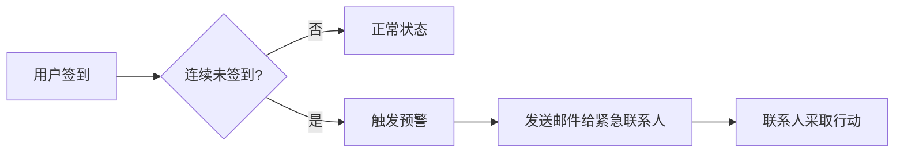
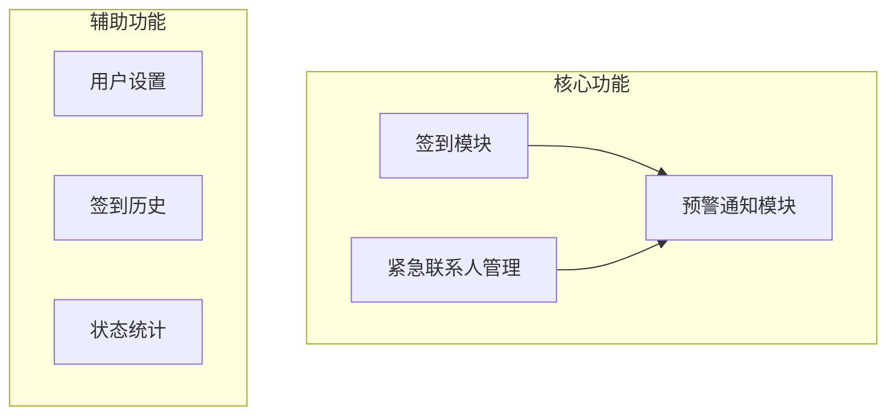
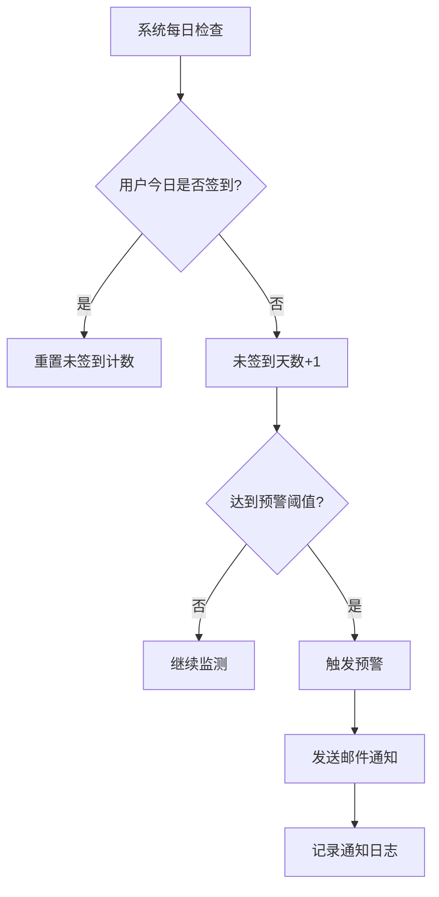
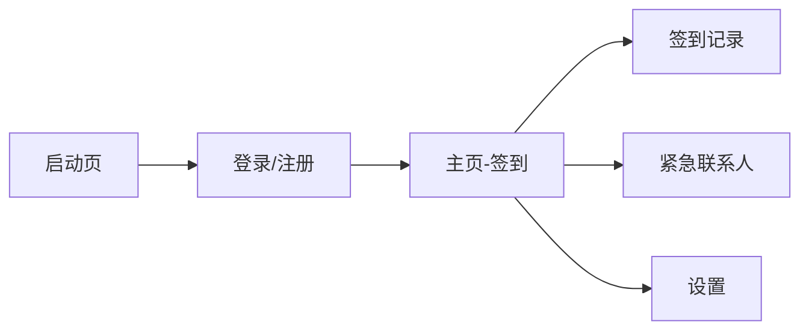
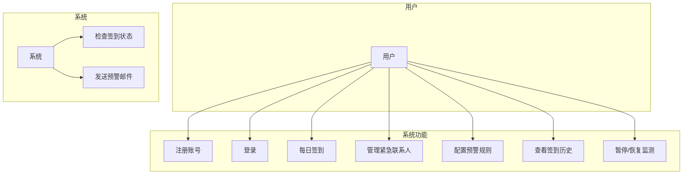

# 死了么 APP 需求文档 (MVP版本)

> 版本: V1.1 MVP  
> 日期: 2026-01-10  
> 状态: 修订版（收敛 MVP 范围）

---

## 1. 项目概述

### 1.1 产品定位

"死了么"是一款专为**独居人群**设计的**轻量化安全工具**，通过每日签到监测与紧急联络机制，为用户提供生命安全保障。当用户连续多日未签到时，系统自动通知紧急联系人，确保在意外发生时能够及时获得帮助。

### 1.2 目标用户

| 用户群体 | 特征描述 |
|---------|---------|
| 独居年轻人 | 在外打工/求学，远离家人 |
| 独居老人 | 子女不在身边，需要远程关怀 |
| 独居慢性病患者 | 有突发疾病风险 |
| 经常出差人士 | 长期独自外出工作 |

### 1.3 产品价值



### 1.4 MVP 收敛范围

> [!IMPORTANT]
> 本文档定义的是 **最小可行产品(MVP)** 范围，后续版本功能已明确标注优先级。

| 类别 | MVP 保留 | MVP 暂缓 |
|-----|---------|----------|
| 认证 | 邮箱注册、密码登录 | 刷新令牌、找回密码 |
| 签到 | 每日签到、今日状态 | 签到统计/日历、心情备注 |
| 联系人 | 添加/删除/验证 | 通知历史详情 |
| 设置 | 预警天数、提醒时间、暂停监测 | 复杂提醒策略 |
| 技术 | 同步邮件发送、JWT认证 | Redis限流、Token黑名单 |

---

## 2. 功能需求

### 2.1 功能模块总览



### 2.2 用户注册与登录

| 功能项 | 描述 | 优先级 | MVP状态 |
|-------|------|--------|--------|
| 邮箱注册 | 用户通过邮箱注册账号 | P0 | ✅ 保留 |
| 密码登录 | 使用邮箱+密码登录 | P0 | ✅ 保留 |
| 找回密码 | 通过邮箱验证码重置密码 | P1 | ⏸️ 暂缓 |
| 记住登录 | 支持自动登录(长期Token) | P0 | ✅ 保留 |

### 2.3 签到模块

#### 2.3.1 基础签到功能

| 功能项 | 描述 | 优先级 | MVP状态 |
|-------|------|--------|--------|
| 每日签到 | 用户点击按钮完成签到 | P0 | ✅ 保留 |
| 签到提醒 | 每日定时推送签到提醒 | P0 | ✅ 保留 |
| 签到记录 | 查看历史签到记录（简化列表） | P1 | ✅ 保留 |
| 签到统计 | 显示连续签到天数等数据 | P2 | ⏸️ 暂缓 |
| 签到日历 | 日历视图展示签到 | P2 | ⏸️ 暂缓 |
| 心情备注 | 签到时记录心情/备注 | P2 | ⏸️ 暂缓 |

#### 2.3.2 签到规则

- 每日签到窗口：**00:00 - 23:59**
- 签到有效期：每个自然日仅需签到**1次**
- 默认预警阈值：连续**3天**未签到触发预警
- 预警阈值可配置：**1-7天**

### 2.4 紧急联系人管理

| 功能项 | 描述 | 优先级 | MVP状态 |
|-------|------|--------|--------|
| 添加联系人 | 输入联系人姓名+邮箱 | P0 | ✅ 保留 |
| 编辑联系人 | 修改联系人信息 | P1 | ⏸️ 暂缓 |
| 删除联系人 | 移除紧急联系人 | P0 | ✅ 保留 |
| 联系人上限 | 最多支持**5个**紧急联系人 | P0 | ✅ 保留 |
| 邮箱验证 | 添加时发送验证邮件确认 | P0 | ✅ 保留 |

> [!IMPORTANT]
> **合规要求**: 添加紧急联系人时需明确告知对方被设为联系人的事实，邮件中需包含隐私说明及拒绝/退订链接。

### 2.5 预警通知模块

#### 2.5.1 预警触发条件



#### 2.5.2 邮件通知内容

**邮件主题:** 【紧急】您的朋友 {用户昵称} 已连续 {N} 天未签到

**邮件正文模板:**
```
尊敬的 {联系人姓名}：

您好！

您被设为 {用户昵称}({用户邮箱}) 的紧急联系人。

我们检测到该用户已连续 {N} 天未在"死了么"应用中签到。
最后一次签到时间：{最后签到时间}

请您尽快尝试与其取得联系，确认其是否安全。

此邮件由系统自动发送，请勿直接回复。

—— 死了么 安全保障系统
```

#### 2.5.3 通知策略

| 策略项 | 规则 |
|-------|------|
| 首次通知 | 达到预警阈值时立即发送 |
| 重复通知 | 用户持续未签到，每**24小时**重发一次 |
| 通知上限 | 连续通知最多**7次** |
| 恢复通知 | 用户恢复签到后，通知联系人用户已安全 |

### 2.6 用户设置

| 设置项 | 描述 | 默认值 |
|-------|------|--------|
| 预警天数 | 未签到多少天触发预警 | 3天 |
| 签到提醒时间 | 每日提醒签到的时间 | 20:00 |
| 提醒方式 | APP推送/邮件提醒 | APP推送 |
| 暂停监测 | 临时暂停预警（如出国旅行） | 关闭 |
| 暂停时长 | 暂停监测的天数 | - |

---

## 3. 非功能需求

### 3.1 性能需求 (MVP)

| 指标 | 要求 |
|-----|------|
| 签到响应时间 | ≤ 2秒 |
| 邮件发送延迟 | ≤ 10分钟 |
| 系统可用性 | ≥ 99% |
| 并发用户数 | 支持 1,000+ |

### 3.2 安全需求

| 安全项 | 措施 |
|-------|------|
| 数据传输 | HTTPS加密 |
| 密码存储 | BCrypt加密 |
| 敏感信息 | 邮箱脱敏显示 |
| 防刷机制 | 签到接口限流 |

### 3.3 兼容性需求

| 平台 | 版本要求 |
|-----|---------|
| iOS | ≥ 12.0 |
| Android | ≥ 6.0 |

---

## 4. 用户界面设计

### 4.1 主要页面



### 4.2 页面原型说明

#### 4.2.1 主页（签到页）

| 元素 | 说明 |
|-----|------|
| 状态显示 | 显示当前安全状态（已签到/待签到） |
| 签到按钮 | 大按钮，居中显示，一键签到 |
| 连续签到 | 显示连续签到天数 |
| 快捷入口 | 联系人管理、设置入口 |

#### 4.2.2 紧急联系人页

| 元素 | 说明 |
|-----|------|
| 联系人列表 | 显示已添加的联系人 |
| 添加按钮 | 添加新联系人入口 |
| 编辑/删除 | 滑动操作或长按操作 |

#### 4.2.3 设置页

| 元素 | 说明 |
|-----|------|
| 预警设置 | 预警天数配置 |
| 提醒设置 | 提醒时间、方式配置 |
| 账号设置 | 修改密码、退出登录 |
| 关于我们 | 版本信息、隐私政策 |

---

## 5. 用例分析

### 5.1 核心用例图



### 5.2 用例详情

#### 用例1：每日签到

| 项目 | 内容 |
|-----|------|
| **用例名称** | 每日签到 |
| **参与者** | 用户 |
| **前置条件** | 用户已登录 |
| **主流程** | 1. 用户打开APP<br>2. 进入主页<br>3. 点击签到按钮<br>4. 系统记录签到<br>5. 显示签到成功 |
| **后置条件** | 签到记录保存，重置未签到计数 |

#### 用例2：预警通知

| 项目 | 内容 |
|-----|------|
| **用例名称** | 预警通知 |
| **参与者** | 系统、紧急联系人 |
| **前置条件** | 用户连续N天未签到 |
| **主流程** | 1. 系统检测到未签到达到阈值<br>2. 获取用户紧急联系人列表<br>3. 向每个联系人发送邮件<br>4. 记录通知日志 |
| **后置条件** | 联系人收到预警邮件 |

---

## 6. 数据字典

### 6.1 用户表 (users)

| 字段 | 类型 | 说明 |
|-----|------|------|
| id | BIGINT | 主键 |
| email | VARCHAR(100) | 用户邮箱 |
| password | VARCHAR(255) | 加密密码 |
| nickname | VARCHAR(50) | 用户昵称 |
| alert_days | INT | 预警天数阈值 |
| reminder_time | TIME | 提醒时间 |
| is_paused | BOOLEAN | 是否暂停监测 |
| pause_until | DATETIME | 暂停截止时间 |
| created_at | DATETIME | 创建时间 |
| updated_at | DATETIME | 更新时间 |

### 6.2 签到记录表 (check_ins)

| 字段 | 类型 | 说明 |
|-----|------|------|
| id | BIGINT | 主键 |
| user_id | BIGINT | 用户ID |
| check_in_date | DATE | 签到日期 |
| check_in_time | DATETIME | 签到时间 |
| created_at | DATETIME | 创建时间 |

### 6.3 紧急联系人表 (emergency_contacts)

| 字段 | 类型 | 说明 |
|-----|------|------|
| id | BIGINT | 主键 |
| user_id | BIGINT | 用户ID |
| name | VARCHAR(50) | 联系人姓名 |
| email | VARCHAR(100) | 联系人邮箱 |
| is_verified | BOOLEAN | 是否已验证 |
| created_at | DATETIME | 创建时间 |

### 6.4 通知记录表 (notifications)

| 字段 | 类型 | 说明 |
|-----|------|------|
| id | BIGINT | 主键 |
| user_id | BIGINT | 用户ID |
| contact_id | BIGINT | 联系人ID |
| type | VARCHAR(20) | 通知类型 |
| status | VARCHAR(20) | 发送状态 |
| sent_at | DATETIME | 发送时间 |

---

## 7. 约束与假设

### 7.1 约束条件

1. MVP版本仅支持**邮件通知**，不含短信
2. 首期不支持**社交分享**功能
3. 仅支持**中文**界面
4. **技术栈**: Flutter (iOS+Android) + Spring Boot + MySQL
5. 邮件发送采用**同步方式**，无消息队列

### 7.2 假设条件

1. 用户有稳定的**邮箱账号**
2. 紧急联系人会**查看邮件**
3. 用户有**每日使用手机**的习惯

### 7.3 时区与计算规则

| 规则项 | 说明 |
|-------|------|
| 服务器时区 | 统一使用 `Asia/Shanghai` (UTC+8) |
| 签到日期判定 | 以服务器时区的自然日为准 |
| 暂停期间 | 不计入未签到天数，不触发预警 |
| 预警检查时间 | 每日 00:30 执行，确保前一日签到已全部完成 |

---

## 8. 版本规划

| 版本 | 功能范围 | 目标 |
|-----|---------|------|
| V1.0 | 核心签到+邮件通知 | MVP上线 |
| V1.1 | 短信通知+微信通知 | 多渠道触达 |
| V1.2 | 智能签到（步数/位置） | 降低签到负担 |
| V2.0 | 社区互助+健康数据 | 生态扩展 |

---

## 附录

### A. 术语表

| 术语 | 解释 |
|-----|------|
| 签到 | 用户确认自身安全状态的操作 |
| 预警阈值 | 触发通知的未签到连续天数 |
| 紧急联系人 | 用户指定的安全联络对象 |

### B. 修订历史

| 版本 | 日期 | 修订人 | 说明 |
|-----|------|-------|------|
| V1.0 | 2026-01-10 | - | 初稿 |
