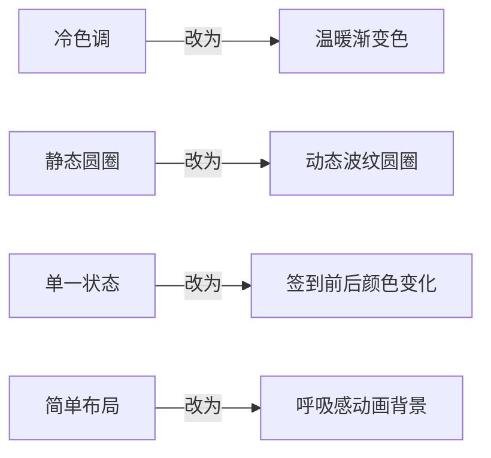
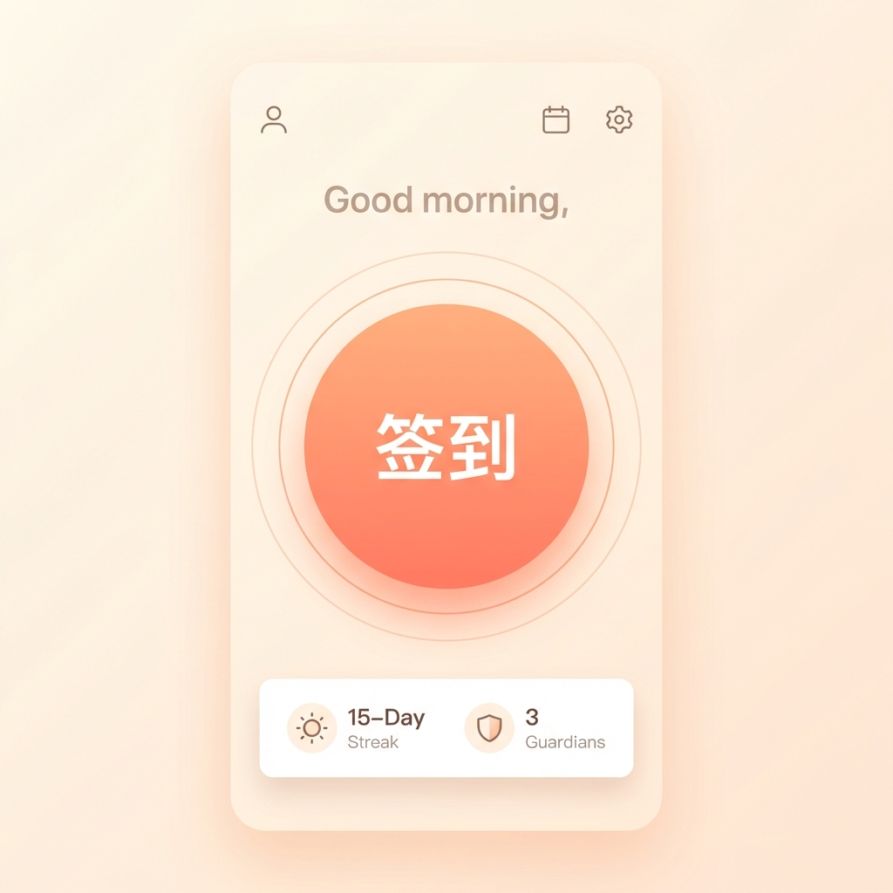
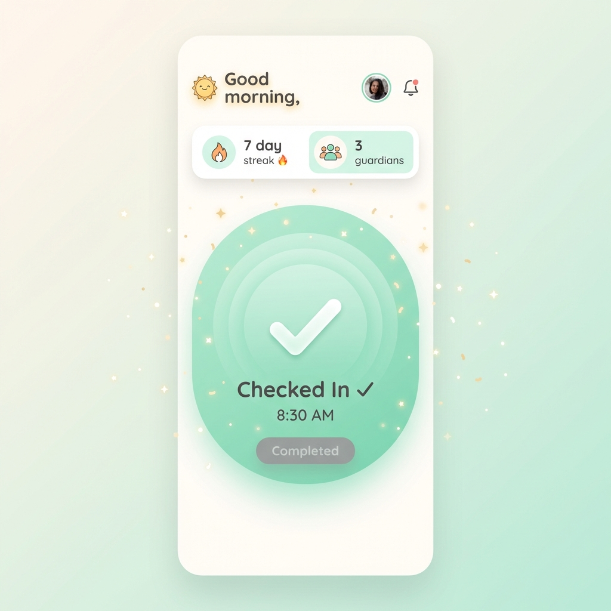

# 首页 UI 重新设计方案

## 一、现状分析

### 当前问题

经过分析 [HomeScreen.kt](file:///c:/Users/18438/Desktop/sileme/silemore-app-legacy-android/app/src/main/java/com/silemore/sileme/ui/screens/HomeScreen.kt)，发现以下问题：

| 问题类型 | 具体描述 |
|---------|---------|
| 🎨 色彩单调 | 使用冷色调（青灰色 `#2F5C6E`），缺乏温馨感 |
| ⚡ 动效不足 | 签到圆圈是静态的 `Surface`，没有动态效果 |
| 📐 布局简单 | 仅一个圆形卡片居中，缺乏层次感 |
| 🌊 无波动效果 | 签到按钮没有任何波纹/水波动画 |
| 💫 状态反馈弱 | 签到前后只是文字变化，缺乏视觉冲击 |

### 当前签到圆圈代码结构

```kotlin
// 静态 Surface，无动画
Surface(
    shape = CircleShape,
    color = MaterialTheme.colorScheme.surface,  // 普通背景色
    shadowElevation = 4.dp,
    border = BorderStroke(1.dp, ...)
) {
    // 简单的文字和按钮
}
```

---

## 二、设计目标

### 整体风格

> **温馨 · 生命力 · 希望**

应用主题围绕"守护生命"，设计风格应该传递温暖、安心的感觉。

### 核心改进



---

## 三、配色方案

### 温馨配色表

| 状态 | 主色 | 渐变色 | 含义 |
|-----|------|-------|------|
| **待签到** | `#FF9A6C` (珊瑚橙) | `#FFB88C` → `#FF9A6C` | 温暖提醒 |
| **已签到** | `#7ED6A5` (薄荷绿) | `#A8E6CF` → `#7ED6A5` | 安心完成 |
| **暂停中** | `#B8C4CE` (柔灰) | `#D1D9E0` → `#B8C4CE` | 休息状态 |

### 新色彩定义

```kotlin
// Color.kt 新增温馨色

// 待签到状态 - 温暖珊瑚色系
val CoralWarm = Color(0xFFFF9A6C)
val CoralLight = Color(0xFFFFB88C)
val CoralGlow = Color(0x40FF9A6C)

// 已签到状态 - 清新薄荷绿系
val MintFresh = Color(0xFF7ED6A5)
val MintLight = Color(0xFFA8E6CF)
val MintGlow = Color(0x407ED6A5)

// 背景渐变色
val WarmBackground = Color(0xFFFFF8F5)      // 暖白色背景
val WarmBackgroundDark = Color(0xFF1A1614)  // 暖黑色背景
```

---

## 四、动态签到圆圈设计

### 4.1 设计理念

> **整个圆形即是按钮** - 用户点击整个圆形区域即可完成签到，无需单独按钮

### 4.2 多层波纹效果

设计一个带有 **3 层同心波纹** 的签到圆圈，波纹持续向外扩散，**整个圆形可点击**：

```
     ╭─────────────────────╮
    ╭┤                     ├╮  ← 第三层波纹 (最外层，最透明)
   ╭┤│                     │├╮ ← 第二层波纹
  ╭┤││   ╭─────────────╮   ││├╮← 第一层波纹
  │││   │             │   │││
  │││   │    签 到     │   │││ ← 中心圆 (点击区域，大字居中)
  │││   │             │   │││
  ╰┤││   ╰─────────────╯   ││├╯
   ╰┤│                     │├╯
    ╰┤                     ├╯
     ╰─────────────────────╯
```

### 4.3 波纹动画参数

| 波纹层 | 初始大小 | 扩散大小 | 透明度变化 | 动画时长 | 延迟 |
|-------|---------|---------|-----------|---------|-----|
| 第1层 | 100% | 130% | 0.6 → 0 | 2000ms | 0ms |
| 第2层 | 100% | 130% | 0.4 → 0 | 2000ms | 666ms |
| 第3层 | 100% | 130% | 0.2 → 0 | 2000ms | 1333ms |

### 4.4 签到状态变化

#### 签到前 (待签到)

```
┌─────────────────────────────────────────────────────┐
│                                                     │
│     🔸 波纹颜色: 珊瑚橙 (#FF9A6C)                    │
│     🔸 波纹速度: 正常 (2秒/周期)                     │
│     🔸 中心渐变: 从 #FFB88C 到 #FF9A6C              │
│     🔸 圆形内文字: "签到" (大号白色字体，居中)        │
│     🔸 整个圆形可点击                                │
│                                                     │
└─────────────────────────────────────────────────────┘
```

#### 签到后 (已完成)

```
┌─────────────────────────────────────────────────────┐
│                                                     │
│     ✅ 触发签到成功动画 (0.5秒)                      │
│        - 波纹快速扩散一次 (庆祝效果)                 │
│        - 中心圆缩放弹跳 (1.0 → 0.85 → 1.05 → 1.0)  │
│                                                     │
│     ✅ 之后进入已签到状态                            │
│        - 波纹颜色: 薄荷绿 (#7ED6A5)                 │
│        - 波纹速度: 慢速 (3秒/周期)                  │
│        - 中心渐变: 从 #A8E6CF 到 #7ED6A5           │
│        - 圆形内文字: "已签到" + ✓ 图标              │
│        - 整个圆形不可再点击                          │
│                                                     │
└─────────────────────────────────────────────────────┘
```

---

## 五、代码实现方案

### 5.1 新增文件

| 文件路径 | 描述 |
|---------|------|
| `ui/components/WaveCircle.kt` | 波纹动画 + 可点击签到圆圈 |
| `ui/components/AnimatedGradientBackground.kt` | 动态渐变背景 |

### 5.2 WaveCircle 组件设计 (整个圆形可点击)

```kotlin
@Composable
fun WaveCircle(
    modifier: Modifier = Modifier,
    isCheckedIn: Boolean,
    isPaused: Boolean,
    onCheckIn: () -> Unit
) {
    val infiniteTransition = rememberInfiniteTransition(label = "wave")
    
    // 点击弹跳动画
    var isPressed by remember { mutableStateOf(false) }
    val scale by animateFloatAsState(
        targetValue = if (isPressed) 0.92f else 1f,
        animationSpec = spring(
            dampingRatio = Spring.DampingRatioMediumBouncy,
            stiffness = Spring.StiffnessMedium
        ),
        finishedListener = { isPressed = false }
    )
    
    // 3层波纹，使用不同的相位偏移
    val wavePhases = listOf(0f, 0.33f, 0.66f)
    
    // 根据签到状态选择颜色
    val waveColor by animateColorAsState(
        targetValue = when {
            isPaused -> MistGray
            isCheckedIn -> MintFresh
            else -> CoralWarm
        },
        animationSpec = tween(500)
    )
    
    // 波纹动画速度 (已签到后变慢)
    val waveDuration = if (isCheckedIn) 3000 else 2000
    
    Box(
        modifier = modifier.graphicsLayer {
            scaleX = scale
            scaleY = scale
        },
        contentAlignment = Alignment.Center
    ) {
        // 绘制3层波纹
        wavePhases.forEachIndexed { index, phase ->
            val progress by infiniteTransition.animateFloat(
                initialValue = 0f,
                targetValue = 1f,
                animationSpec = infiniteRepeatable(
                    animation = tween(waveDuration, easing = LinearOutSlowInEasing),
                    repeatMode = RepeatMode.Restart,
                    initialStartOffset = StartOffset((waveDuration * phase).toInt())
                ),
                label = "wave_$index"
            )
            
            Canvas(modifier = Modifier.size(280.dp)) {
                val waveScale = 1f + (progress * 0.3f)
                val alpha = (1f - progress) * (0.6f - index * 0.2f)
                
                drawCircle(
                    color = waveColor.copy(alpha = alpha),
                    radius = size.minDimension / 2 * waveScale,
                    style = Stroke(width = 2.dp.toPx())
                )
            }
        }
        
        // 中心可点击圆形
        ClickableCircle(
            isCheckedIn = isCheckedIn,
            isPaused = isPaused,
            waveColor = waveColor,
            onClick = {
                if (!isCheckedIn && !isPaused) {
                    isPressed = true
                    onCheckIn()
                }
            }
        )
    }
}
```

### 5.3 可点击中心圆 (简洁设计)

```kotlin
@Composable
private fun ClickableCircle(
    isCheckedIn: Boolean,
    isPaused: Boolean,
    waveColor: Color,
    onClick: () -> Unit
) {
    // 渐变色
    val gradientColors = when {
        isPaused -> listOf(MistGray, MistGray.copy(alpha = 0.7f))
        isCheckedIn -> listOf(MintLight, MintFresh)
        else -> listOf(CoralLight, CoralWarm)
    }
    
    Box(
        modifier = Modifier
            .size(220.dp)
            .clip(CircleShape)
            .background(
                brush = Brush.radialGradient(
                    colors = gradientColors,
                    center = Offset(110f, 110f),
                    radius = 220f
                )
            )
            .clickable(
                enabled = !isCheckedIn && !isPaused,
                onClick = onClick,
                indication = rememberRipple(color = Color.White),
                interactionSource = remember { MutableInteractionSource() }
            )
            .border(
                width = 3.dp,
                brush = Brush.linearGradient(
                    colors = listOf(
                        Color.White.copy(alpha = 0.5f),
                        waveColor.copy(alpha = 0.3f)
                    )
                ),
                shape = CircleShape
            ),
        contentAlignment = Alignment.Center
    ) {
        // 只显示简洁的文字
        Row(
            verticalAlignment = Alignment.CenterVertically,
            horizontalArrangement = Arrangement.Center
        ) {
            if (isCheckedIn) {
                Icon(
                    imageVector = Icons.Default.Check,
                    contentDescription = null,
                    modifier = Modifier.size(32.dp),
                    tint = Color.White
                )
                Spacer(Modifier.width(8.dp))
            }
            
            Text(
                text = when {
                    isPaused -> "暂停中"
                    isCheckedIn -> "已签到"
                    else -> "签到"
                },
                style = MaterialTheme.typography.headlineLarge,
                fontWeight = FontWeight.Bold,
                color = Color.White,
                fontSize = 36.sp
            )
        }
    }
}
```

### 5.4 调用示例

```kotlin
// 在 HomeScreen 中使用
WaveCircle(
    isCheckedIn = state.today?.hasCheckedIn == true,
    isPaused = state.profile?.isPaused == true,
    onCheckIn = viewModel::checkIn,
    modifier = Modifier.padding(32.dp)
)
```

---

## 六、页面整体布局

### 6.1 新布局结构

```
┌─────────────────────────────────────────┐
│  TopAppBar (透明渐变)                    │
│  ┌─────────────────────────────────────┐│
│  │ 今日          [刷新][历史][守护][设置]││
│  └─────────────────────────────────────┘│
├─────────────────────────────────────────┤
│                                         │
│     ╭─── 欢迎语 (早上好/下午好) ───╮     │
│     │      用户昵称，今天感觉如何？    │     │
│     ╰─────────────────────────────╯     │
│                                         │
│            🌊 波纹签到圆圈 🌊            │
│         ╭───────────────────╮          │
│        ╭┤                   ├╮         │
│       ╭││                   ││╮        │
│       │││                   │││        │
│       │││      签 到        │││  ← 大字居中，整个圆可点击
│       │││                   │││        │
│       ╰││                   ││╯        │
│        ╰┤                   ├╯         │
│         ╰───────────────────╯          │
│                                         │
│     ╭─── 今日状态卡片 ───╮              │
│     │ 连续签到: 7 天 🔥  │              │
│     │ 守护人: 3 位        │              │
│     ╰────────────────────╯              │
│                                         │
└─────────────────────────────────────────┘
```

### 6.2 动态背景

添加一个轻微浮动的渐变背景，增加生命力：

```kotlin
@Composable
fun AnimatedGradientBackground(
    modifier: Modifier = Modifier,
    content: @Composable () -> Unit
) {
    val infiniteTransition = rememberInfiniteTransition()
    
    // 渐变偏移动画
    val offset by infiniteTransition.animateFloat(
        initialValue = 0f,
        targetValue = 1f,
        animationSpec = infiniteRepeatable(
            animation = tween(8000, easing = LinearEasing),
            repeatMode = RepeatMode.Reverse
        )
    )
    
    Box(
        modifier = modifier
            .fillMaxSize()
            .background(
                brush = Brush.verticalGradient(
                    colors = listOf(
                        WarmBackground,
                        WarmBackground.copy(alpha = 0.95f),
                        Color(0xFFFFF0E8).copy(alpha = lerp(0.3f, 0.6f, offset))
                    )
                )
            )
    ) {
        content()
    }
}
```

---

## 七、文件修改清单

### 需要修改的文件

| 文件 | 修改内容 |
|-----|---------|
| [Color.kt](file:///c:/Users/18438/Desktop/sileme/silemore-app-legacy-android/app/src/main/java/com/silemore/sileme/ui/theme/Color.kt) | 添加温馨配色 |
| [Theme.kt](file:///c:/Users/18438/Desktop/sileme/silemore-app-legacy-android/app/src/main/java/com/silemore/sileme/ui/theme/Theme.kt) | 更新颜色方案 |
| [HomeScreen.kt](file:///c:/Users/18438/Desktop/sileme/silemore-app-legacy-android/app/src/main/java/com/silemore/sileme/ui/screens/HomeScreen.kt) | 重构为新设计 |

### 需要新增的文件

| 文件 | 描述 |
|-----|------|
| `ui/components/WaveCircle.kt` | 波纹动画 + 可点击签到圆圈 (整合) |
| `ui/components/AnimatedGradientBackground.kt` | 渐变背景 |
| `ui/components/GreetingHeader.kt` | 欢迎语组件 |
| `ui/components/StatusCard.kt` | 今日状态卡片 |

---

## 八、效果预览对比

### 改进前

```
┌───────────────────────┐
│  冷色调 (#2F5C6E)     │
│  静态圆形              │
│  无波纹效果            │
│  简单文字按钮          │
└───────────────────────┘
```

### 改进后

```
┌───────────────────────┐
│  温暖渐变 (珊瑚/薄荷)  │
│  3层动态波纹扩散       │
│  整个圆形可点击签到    │
│  简洁大字 "签到"       │  
│  签到成功弹跳庆祝      │
│  呼吸感背景            │
└───────────────────────┘
```

---

## 九、动画性能考虑

| 优化点 | 措施 |
|-------|------|
| 波纹数量 | 限制为3层，避免过度绘制 |
| 动画精度 | 使用 `graphicsLayer` 进行硬件加速 |
| 内存占用 | 使用 `remember` 缓存计算结果 |
| 电池消耗 | 已签到后降低动画频率 (2s→3s) |

---

## 十、实施顺序

1. ⬜ 更新 `Color.kt` 添加温馨配色
2. ⬜ 更新 `Theme.kt` 应用新配色
3. ⬜ 创建 `WaveCircle.kt` 波纹组件
4. ⬜ 创建 `CheckInButton.kt` 签到按钮
5. ⬜ 创建 `AnimatedGradientBackground.kt` 动态背景
6. ⬜ 重构 `HomeScreen.kt` 使用新组件
7. ⬜ 测试动画效果和性能
8. ⬜ 调整配色和动画参数

---

## 十一、效果图预览

### 待签到状态 (简洁设计)



### 已签到状态



---

## 十二、总结

本设计方案通过以下改进提升用户体验：

| 改进点 | 效果 |
|-------|------|
| 🎨 温馨配色 | 从冷青色改为珊瑚/薄荷渐变，传递温暖感 |
| 🌊 动态波纹 | 3层波纹持续扩散，增加生命力 |
| ✨ 状态反馈 | 签到成功弹跳动画，增强操作反馈 |
| 🏠 整体氛围 | 渐变背景+欢迎语，营造家的感觉 |
| ⚡ 性能优化 | 硬件加速动画，已签到后降低频率 |
